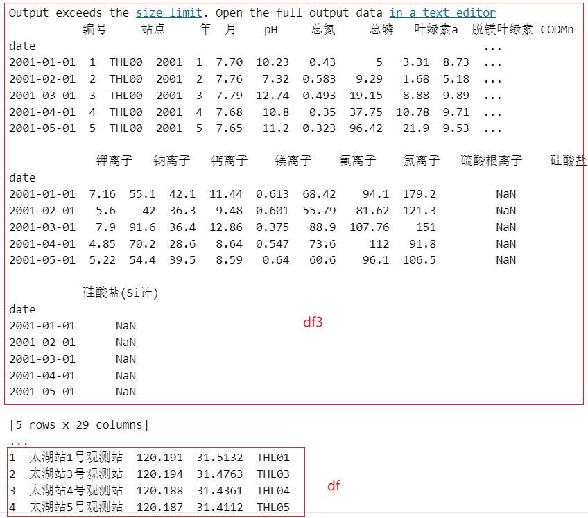

## 1. 数据来源

[和鲸社区-太湖站2001-2006年水质监测数据集](https://www.heywhale.com/mw/dataset/626155316731be0017382112)

包括两个文件：

1. 太湖站水质观测站点数据.xlsx
2. 2001-2006年太湖水体物理及水体化学监测数据.xlsx


## 2. 站点分布示意图

```python
import pandas as pd
import folium
import matplotlib.pyplot as plt
# 1. 读取数据
df = pd.read_excel(r'.\太湖站水质观测站点数据.xlsx')
print(df.head())

# Drop the second row of the dataframe to remove the header
df = df.drop([0])
# Reset the index of the dataframe
df = df.reset_index(drop=True)


# 2. 画出站点分布

# Create a map object centered at (31.3, 120.6)
# Set the range of longitude and latitude for the map
east_min = df['东经'].min() - 5
east_max = df['东经'].max() + 5
north_min = df['北纬'].min() - 5
north_max = df['北纬'].max() + 5

# Create a map object centered at  with the new range of longitude and latitude
map = folium.Map(location=[(north_max+north_min)/2, (east_max+east_min)/2], zoom_start=10,  control_scale=True, tiles='Stamen Terrain')
# tiles表示地图的样式；max_bounds表示地图的最大范围；control_scale表示是否显示比例尺
# Add markers to the map for each observation station
for index, row in df.iterrows():
    folium.Marker(location=[row['北纬'], row['东经']], tooltip=row['观测站代码']).add_to(map)

# Display the map
map

# Save the map as an HTML file
map.save('map.html')
```


## 3. 物理性质数据分析

对水深随着时间变化进行探究。

```python
import pandas as pd
import matplotlib.pyplot as plt
# 读入2001-2006年太湖水体物理及水体化学监测数据.xlsx中的表格2001-2006年太湖水体物理监测数据
df2 = pd.read_excel(r'.\2001-2006年太湖水体物理及水体化学监测数据.xlsx', sheet_name='2001-2006年太湖水体物理监测数据')
df2 = df2.drop([0])
# Reset the index of the dataframe
df2 = df2.reset_index(drop=True)
# Round the values in the '年' column to the nearest integer
df2['年'] = df2['年'].astype(int)
df2['月'] = df2['月'].astype(int)
# Combine the '年' and '月' columns into a single 'date' column in df2
df2['date'] = pd.to_datetime({'year': df2['年'], 'month': df2['月'], 'day': 1})
print(df2.head())

# 画出水深随时间变化的折线图
df2_THL00 = df2[df2['站点'] == 'THL00']
df2_THL00 = df2_THL00.set_index('date')
df2_THL00['水深'].plot()
# title表示图的标题；xlabel表示x轴的标题；ylabel表示y轴的标题
plt.title('THL00 Water Depth')
plt.xlabel('Date')
plt.ylabel('Water Depth (m)')

# 画出所有的站点水深随时间变化的折线图
for station in df2['站点'].unique():
    df2_station = df2[df2['站点'] == station]
    df2_station = df2_station.set_index('date')
    df2_station['水深'].plot()
    plt.title(station + ' Water Depth')
    plt.xlabel('Date')
    plt.ylabel('Water Depth (m)')
    plt.show()

# 画在一张图上
# 设置图的大小
plt.figure(figsize=(10, 10))
for station in df2['站点'].unique():
    df2_station = df2[df2['站点'] == station]
    df2_station = df2_station.set_index('date')
    df2_station['水深'].plot()
plt.title('Water Depth')
plt.xlabel('Date')
plt.ylabel('Water Depth (m)')
# 设置legend的位置在图的外面
plt.legend(df2['站点'].unique(), loc='center left', bbox_to_anchor=(1, 0.5))
plt.show()
```

输出结果部分：


## 4. 化学性质数据分析

对PH值进行探究，使用克里金插值的方法。

```python
import pandas as pd
# 读入2001-2006年太湖水体物理及水体化学监测数据.xlsx中的表格2001-2006年太湖水体物理监测数据
df3 = pd.read_excel(r'.\2001-2006年太湖水体物理及水体化学监测数据.xlsx', sheet_name='2001-2006年太湖水体化学监测数据')
df3 = df3.drop([0])
# Reset the index of the dataframe
df3 = df3.reset_index(drop=True)
# Round the values in the '年' column to the nearest integer
df3['年'] = df3['年'].astype(int)
df3['月'] = df3['月'].astype(int)
# Combine the '年' and '月' columns into a single 'date' column in df3
df3['date'] = pd.to_datetime({'year': df3['年'], 'month': df3['月'], 'day': 1})
df3=df3.set_index('date')
print(df3.head())


# 读取站点位置
df = pd.read_excel(r'.\太湖站水质观测站点数据.xlsx')
# Drop the second row of the dataframe to remove the header
df = df.drop([0])
# Reset the index of the dataframe
df = df.reset_index(drop=True)

# Rename the columns
df['站点'] = df['观测站代码']
# drop columns
df = df.drop(['观测站序号','观测站代码'], axis=1) # axis=1表示列
print(df.head())

# 提取df3中的两列，分别是站点和PH值
df3_ph = df3[['站点', 'pH']]

df3_ph_20010101 = df3_ph[df3_ph.index == '2001-01-01']

# 根据站点拼接df3_ph_20010101和df
df_merged = pd.merge(df, df3_ph_20010101, on='站点', how='left')

# 克里金插值，df_merged中的ph
# 克里金插值需要使用外部库pykrige，需要先安装
# pip install pykrige

# 导入外部库
import numpy as np
from pykrige.ok import OrdinaryKriging


# 将df_merged中的经纬度和pH值提取出来
X = df_merged[['东经', '北纬']].values
y = df_merged['pH'].values

# 设置克里金插值的网格范围
grid_lon = np.arange(df_merged['东经'].min()-0.1, df_merged['东经'].max()+0.1, 0.01)
grid_lat = np.arange(df_merged['北纬'].min()-0.1, df_merged['北纬'].max()+0.1, 0.01)


# Generate ordinary kriging object
OK = OrdinaryKriging(
    np.array(X[:, 0]),
    np.array(X[:, 1]),
    y,
    variogram_model = "linear",
    verbose = False,
    enable_plotting = False,
    coordinates_type = "euclidean",
)

# 进行克里金插值
z, ss = OK.execute('grid', grid_lon, grid_lat) 

# 将插值结果可视化
plt.figure(figsize=(10, 10))
# pcolor of z
plt.pcolor(grid_lon, grid_lat, z, cmap='jet')
plt.colorbar()
#plt.scatter(X[:, 0], X[:, 1], c=y, cmap='jet', edgecolor='k')
plt.title('pH Interpolation')
plt.xlabel('Longitude')
plt.ylabel('Latitude')
plt.show()
```

部分结果输出如下：




克里金插值结果如下：（感觉是错的，不改了）

